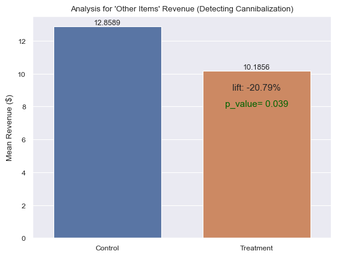
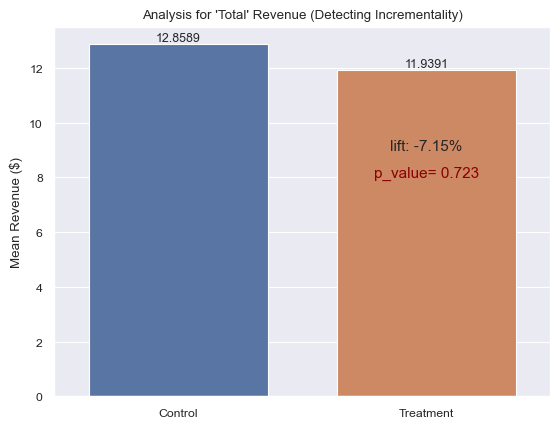

# Overview
The goal of this project is to perform an A/B test to evaluate the impact of the introduction of the new Gold subscription offer into an game app's store.

# Scenario
A mobile app design team wants to add a new subscription to a game's shop that a offers 'Gold', a scarce soft currency, necessary to level up cards.

The game's shop has different types of offers, some of them constant, others with subscription, and others with a imited stock for a limited time. The prices of these offers range from $0.99 up to $99.99.
The items have different prices from $0.99 up to $99.99.

The team wants to test if this new Gold subscription `gold_sub` is a good net revenue complement (increasing total revenue) or a substitute (stealing revenue from existing items without adding enough new value).

# Test Design

## Data collection
For this experiment the Control group would not see the new Gold subscription in the shop, while users in the treatment group would see the offer in the shop.
the experiment ran for about 90 days and only logged users who made a purchase. this experiment collected 1851 logs of transactions.

## Test type selection
Given that the data doesn't follow a normal distribution, the type of test selected is the **Mann-Whitney U** test (See [notebook](GoldSub_hypothesis_test.ipynb) for more details)

## Hypothesis definitions
In order to know the impact of the new gold subcription, two hypothesis tests need to be evaluated: 
- *Test 1:* The first test evaluates the impact of the new gold subcription on the "other" existing offers revenue.
- *Test2:* The second test is to evaluate if the new gold subscription did some impact on the overall revenue.

### Test 1
 For this test both groups are going to contain only existing items offered in the shop, or rather, excluding the gold subscription. This test will compae and determine if the addition of the new subscription is "Canibalising" the existing offers.

- Null Hypothesis $H_0$: The ``gold_sub`` has no impact on revenue from existing items.
    - $H_0: \mu_{treatment\_other} = \mu_{control\_other}$
- Alternative Hypothesis $H_1$: The ``gold_sub`` significantly impacts revenue from existing items.
    - $H_1: \mu_{treatment\_other} \neq \mu_{control\_other}$

### Test 2
For the second test evaluates the total app revenue (Gold_sub + Other items) to see if the new subcription grew the overall revenue, even if it cannibalized other items.

- $H_0$: The ``gold_sub`` has no impact on total app revenue.
    - $\mu_{treatment\_total} = \mu_{control\_total}$
- $H_1$: The ``gold_sub`` significantly changes total app revenue.
    - $\mu_{treatment\_total} \neq \mu_{control\_total}$

# Results
## Test 1

The mean revenue in the treatment group is 20.79% lower than the control group. This means the users in the treatment groupare spending a fith less on the `other items`.

The p-value is 3.88%, it is lower than 5%, which indicates that the null hypothesis can be rejected. It can be concluded that the new `gold_sub` offers are 'canibalising' the other items revenue, this means that users are spending less in the other items and more in the gold subscription.

**Decision:** Reject $H_0$. The data shows a significant decrease in existing item sales.

## Test 2

In this case, both groups are too close (only with a 7.25% difference) with a p-value of 0.72 which is very high and fails to reject the null hypothesis. This means that the 7% drop in revenue is due to random noise and the total revenue hasn't been affected by the introduction of the new subscription.

**Decision:** Fail to Reject $H_0$. There is no evidence that the subscription increased the total app revenue.

## Conclusions
- The gold_sub is a direct substitute for existing items. The subscription is currently just moving the revenue from one product to another without growing the business.
- The 20.8% drop in revenue from existing items is compensated by the gold subscription revenue.
- The impact of the gold subscription on the total revenue is neutral and it is a safe addition. It simply offers users a different way to pay for what they were already buying..

## Recomendations
The gold subscription could improve Retention and LTV (Life Time Value) in the long term that could justify the loss of existing items revenue.

## Next steps
Evaluate the impact of the gold subscription on both platforms. Subscriptions perform generally better on iOS. If one platform perform better than the other, there is the possibility to enable the gold subscription in only one platfrom.
