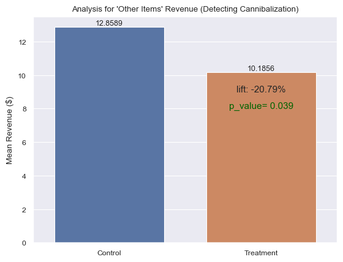
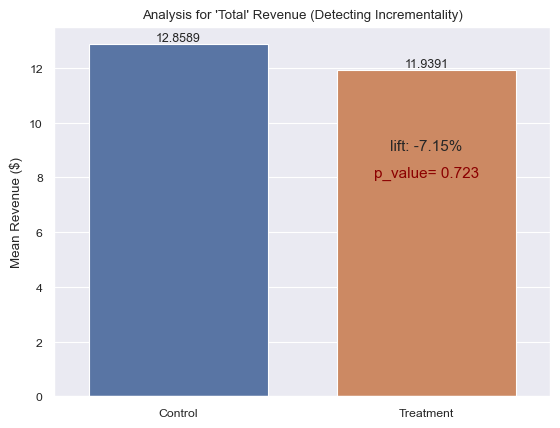

# Overview
The goal of this project is to perform an A/B test to evaluate the impact of introducing a new Gold subscription offer into a game app's store.

# Scenario
A mobile app design team wants to add a new subscription to a game's shop that offers 'Gold', a scarce soft currency necessary to level up cards.

The game's shop has different types of offers, some of them constant,  some are subscriptions, and others have limited stock for a limited time. Prices range from $0.99 to $99.99.The team wants to test if this new Gold subscription (gold_sub) is a net revenue complement (increasing total revenue) or a substitute (stealing revenue from existing items without adding enough new value).

# Test Design

## Data collection
For this experiment, the Control group did not see the new Gold subscription in the shop, while users in the Treatment group did. The experiment ran for approximately 90 days and only logged users who made a purchase. This experiment collected 1,851 transaction logs.

## Test type selection
Given that the data doesn't follow a normal distribution, the **Mann-Whitney U** test was selected (See [notebook](GoldSub_hypothesis_test.ipynb) for more details).

## Hypothesis definitions
To determine the impact of the new Gold subscription, two tests were evaluated:
- *Test 1:* Evaluates the impact of the new Gold subscription on "other" existing offer revenue.
- *Test2:* Evaluates if the new Gold subscription impacted overall revenue.

### Test 1
 For this test, both groups include only existing items offered in the shop (excluding the Gold subscription). This determines if the new subscription is cannibalizing existing offers.

- Null Hypothesis $H_0$: The ``gold_sub`` has no impact on revenue from existing items.

$$\Large H_0: \mu_ {treatment|other} = \mu_ {control|other}$$

- Alternative Hypothesis $H_1$: The ``gold_sub`` significantly impacts revenue from existing items.

$$\Large H_1: \mu_ {treatment|other} \neq \mu_ {control|other}$$

### Test 2
This test evaluates total app revenue (Gold_sub + Other items) to see if the new subscription grew overall revenue, even if it cannibalized other items.

- $H_0$: The ``gold_sub`` has no impact on total app revenue.

$$\Large H_0: \mu_ {treatment|total} = \mu_ {control|total}$$

- $H_1$: The ``gold_sub`` significantly changes total app revenue.

$$\Large H_1: \mu_ {treatment|total} \neq \mu_ {control|total}$$

# Results
## Test 1

The mean revenue in the Treatment group is 20.79% lower than the control group. This indicates the users in the Treatment group are spending a fifth less on the "other items".

The p-value is 3.88% (p < 0.05), which indicates the null hypothesis can be rejected. We conclude that the new gold_sub is cannibalizing revenue from other items; users are shifting their spend toward the subscription. Data shows a significant decrease in existing item sales.

**Decision:** Reject $H_0$.

## Test 2

In this case, the difference between groups is small (7.25%) with a p-value of 0.72. This high p-value fails to reject the null hypothesis. The 7% drop in revenue is likely due to random noise, and total revenue has not been significantly affected by the new subscription.

**Decision:** Fail to Reject $H_0$. 

## Conclusions
- The gold_sub is a direct substitute for existing items. It is currently shifting revenue from one product to another rather than growing the business.

- The 20.8% drop in revenue from existing items is offset by the Gold subscription revenue.

- The impact on total revenue is neutral, making it a "safe" addition that offers users an alternative payment method for existing needs.

## Recommendations
The Gold subscription may improve Retention and LTV (Lifetime Value) in the long term, which could justify the shift in revenue away from existing items.

## Next steps
Evaluate the impact of the Gold subscription by platform. Subscriptions generally perform better on iOS. If one platform outperforms the other, the team could consider enabling the subscription on a single platform.